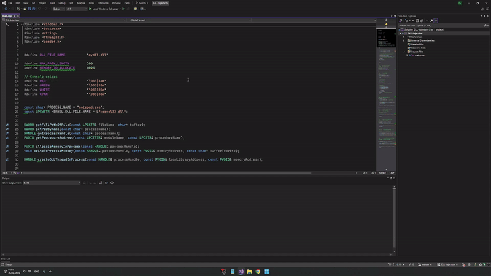

# DLL-Injection



## Installation

To install this project, clone the repository to your local machine using the following command:

```console
$ git clone https://github.com/ItayShallev/DLL-Injection
```


## Usage

Open notepad.exe and run the main.cpp to perform the injection.
